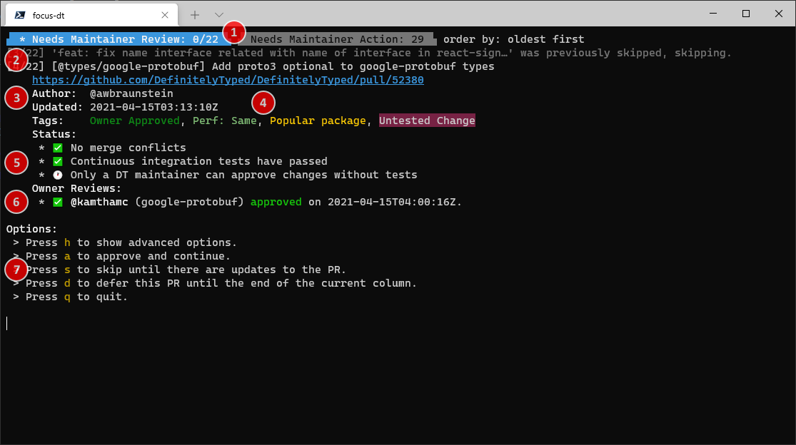
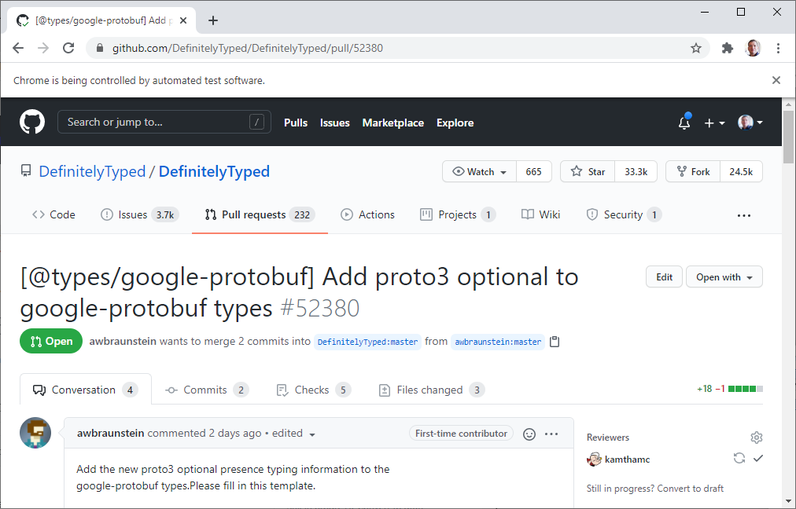

# focus-dt

A simple command-line tool for running down PRs on DefinitelyTyped.

# Installation

```sh
npm i -g focus-dt
```

# Usage

```sh
focus-dt [options]
```

## Options

```
Authentication options:
  --username  GitHub Username                                           [string]
  --token     GitHub Auth Token. Uses %GITHUB_API_TOKEN%,
              %FOCUS_DT_GITHUB_API_TOKEN%, or %AUTH_TOKEN% (in that order) if
              available                                                 [string]

Configuration options:
  --config   Loads settings from a JSON file
                           [string] [default: '%HOMEDIR%/.focus-dt/config.json']
  --save     Saves settings to '%HOMEDIR%/.focus-dt/config.json' and exits
                                                                       [boolean]
  --save-to  Saves settings to the specified file and exits             [string]

Browser options:
  --chromePath  The path to the chromium-based browser executable to use
                (defaults to detecting the current system path for chrome)
                                                                        [string]
  --port        The remote debugging port to use to wait for the chrome tab to
                exit                                                    [number]
  --timeout     The number of milliseconds to wait for the debugger to attach to
                the chrome process (default: 10,000)                    [number]

Options:
  --help, -h     Show help                                             [boolean]
  --version      Show version number                                   [boolean]
  --skipped      Include previously skipped items                      [boolean]
  --needsReview  Include items from the 'Needs Maintainer Review' column of 'New
                 Pull Request Status Board'                            [boolean]
  --needsAction  Include items from the 'Needs Maintainer Action' column of 'New
                 Pull Request Status Board'                            [boolean]
  --oldest       Sort so that the least recently updated cards come first
                                                                       [boolean]
  --newest       Sort so that the most recently updated cards come first
                                                                       [boolean]
  --draft        Include 'Draft' PRs                                   [boolean]
  --wip          Include work-in-progress (WIP) PRs                    [boolean]
  --merge        Set the default merge option to one of 'merge', 'squash', or
                 'rebase'
                      [string] [choices: "merge", "squash", "rebase", undefined]
  --approve      Sets the approval option to one of 'manual', 'auto', 'always',
                 or 'only' (default 'manual'):
                 - 'manual' - Manually approve PRs in the CLI
                 - 'auto' - Approve PRs when merging if they have no other
                 approvers
                 - 'always' - Approve PRs when merging if you haven't already
                 approved
                 - 'only' - [DEPRECATED] Manually approve PRs in the CLI and
                 advance to the next item (disables merging)
                          [string] [choices: "manual", "auto", "always", "only"]
  --verbose, -v  Increases the log level                                 [count]
```

### Token Acquisition

If a GitHub auth token is not provided then the script will look in your host environment for: `GITHUB_API_TOKEN`, `FOCUS_DT_GITHUB_API_TOKEN` and `AUTH_TOKEN` before asking for a token.

When asking for a token, `focus-dt` will use `git credential fill` to use your configured `git` credential helper.

# UI

## Console

When you start `focus-dt` (and have been properly authenticated), you will see a screen like this:



1.  These two tabs indicate the two primary columns in the [Pull Request Status Board](https://github.com/DefinitelyTyped/DefinitelyTyped/projects/5).
    - The active column is highlighted in blue.
    - The number to the right of the column indicates the number of pull request cards in the column
      when `focus-dt` was started (or since the last refresh).
    - If the number is in the format `x/y`, `x` indicates the number of pull requests that you have either
      merged or approved, while `y` indicates the total number of PRs in the column.
    - The current sort order is displayed to the right of the tabs.
2.  This indicates an activity log since the last reviewed PR.
    - Gray lines indicate PRs that were skipped for some reason, either due to configuration, PR status, or 
      because you've explicitly skipped them until a change is made in the PR (such as when you have provided 
      review feedback and are waiting on the author).
    - The white line indicates the current PR to review.
    - The number `[x/y]` indicates the current PR in the column (`x`) and the number of PRs in the column 
      (`y`), to help keep track of progress.
3.  This section indicates information about the PR including:
    - A link to the PR (this may or may not be clickable depending on your terminal).
    - The author of the PR
    - When the PR was last updated.
    - Tags assigned to the PR (see 4 for more information)
4.  The PR's tags are listed here, with ansi colors matching the tag color on GitHub (if possible).
5.  If present, this section indicates the PR status provided by @typescript-bot.
6.  If owners or maintainers have already reviewed the PR, this section lists the review status
    and whether the PR has been updated since the review was made (in which case it will be marked 
    `[outdated]`)
7.  This section indicates the key bindings used to interact with `focus-dt`

## Chrome

In addition, `focus-dt` will attempt to launch a Chrome window with UI automation with a debugger attached.
This lets `focus-dt` reuse the same Chrome tab as you move between PRs. Eventually it may also be used to 
detect when you request changes to a PR to mark it as "skipped".



> NOTE: `focus-dt` may fail to attach to Chrome if an instance was already running when `focus-dt` was 
> started. If that happens, `focus-dt` will likely crash. This is a known issue. Until it has been addressed,
> it is best to ensure there are no Chrome instances running when `focus-dt` is started.

## Keybindings

The default keybindings are:
- `h` &mdash; Shows advanced options. These advanced keybindings are always available, but are generally
  ommitted for brevity.
- `a` &mdash; Approves the PR. If the PR supports author merging, the UI will advance to the next PR after
  approval.
- `m` &mdash; Merges the PR. Depending on configuration, this will approve the PR prior to merging. This
  option is hidden if the PR supports author merging.
- `s` &mdash; Skips this PR until the PR changes. This is often used after you have requested changes or
  if you are waiting on the author. Skipped items will be reviewable again if you use the `--skipped` option
  or if over a week has passed since the item was skipped.
- `d` &mdash; Moves this PR to the end of the queue for the current column. Useful if you want to come back 
  to a review later without marking it as "skipped".
- `q` &mdash; Quits `focus-dt`

Advanced keybindings (visible if you toggle the `h` option) include:
- `alt+a` &mdash; Configure the default approval option.
- `alt+m` &mdash; Configure the default merge option.
- `f` &mdash; Changes the current filters and sort order.
- `ctrl+s` &mdash; Save the current options and filters.

Advanced keybindings (always hidden) include:
- `F5` &mdash; Refresh all columns
